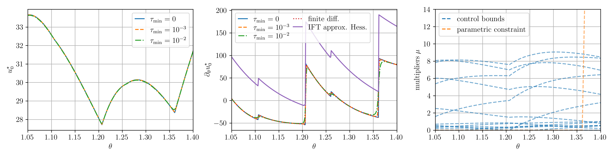

# Differentiable Nonlinear Model Predictive Control

This repository contains the code to repruduce the results presented in the paper **Differentiable Nonlinear Model Predictive Control**.
The proposed algorithms are implemented in the [`acados`](https://github.com/acados/acados) software framework.

**Abstract**: The efficient computation of parametric solution sensitivities is a key challenge in the integration of learning-based methods with nonlinear model predictive control (NMPC), as their availability is crucial for many learning algorithms.
While approaches presented in the machine learning community are limited to convex or unconstrained formulations, this paper discusses the computation of solution sensitivities of general nonlinear programs (NLPs) using the implicit function theorem (IFT) and smoothed optimality conditions treated in interior point methods (IPM).
We detail sensitivity computation within a sequential quadratic programming (SQP) method which employs an IPM for the quadratic subproblems.
The publication is accompanied by an efficient open-source implementation within the $\texttt{acados}$ framework, providing both forward and adjoint sensitivities for general optimal control problems, achieving speedups exceeding 3x over the state-of-the-art solver $\texttt{mpc.pytorch}$.

**Visualization:** Figure 2 of the paper, visualizing the optimization landscape at active set changes of the solution map of an optimal control problem (OCP) as solved in the context of NMPC:

Using higher log barrier parameters $\tau_\textrm{min}$ for the interior point solver, progressively smoothens the solution map.
For a more details, we refer to the paper.

## Requirements

To reproduce the results in the paper, you will need to setup a python environment and install some dependencies:

1. Setup a virtual python environment e.g. using `conda`:
    ```
    conda create --name diff_mpc_2025 python=3.10 -y
    ```
    Activate the environment
    ```
    conda activate diff_mpc_2025
    ```

2. Install `acados` by following the instructions in the [acados installation guide](https://docs.acados.org/installation/index.html).
Add the CMake options `-DACADOS_WITH_OPENMP=ON -DACADOS_NUM_THREADS=1` to ensure acados is compiled with OpenMP and parallelization within a solve is not done, such that parallelization over the batch size can be used, which is most efficient.
Also ensure that you install the [python interface](https://docs.acados.org/python_interface/index.html).
The code is tested with `acados` version `v0.5.0`.

3. Install the python dependencies containing also `mpc.pytorch`, `cvxpy`, `cvxpygen` and `cvxpylayers` by
    ```
    pip install -r requirements.txt
    ```
Note: The version used in the paper are: `cvxpy==1.6.6`, `mpc.pytorch==0.0.6`, `cvxpygen==0.6.3`, `cvxpylayers==0.1.9`

## Running the code
The results of the paper can be reproduced by running different scripts structured in folders.

- **Table 1**: The folder `benchmark_diff_mpc` contains the code to evaluate the performance of `mpc.pytorch`, `acados` and `cvxpygen + cvxpylayers` in terms of speed and correctness.
To reproduce the results run the following scripts from the `benchmark_diff_mpc` folder:

    1. Run `test_linear_mpc.py` to verify the following:
        - for `umax = 1e4`: acados, cvxpy and mpc.pytorch converge to the same solution
        - for `umax = 1e4`: the adjoint solution sensitivities obtained with acados, mpc.pytorch and cvxpygen match
        - for `umax = 1.0`: mpc.pytorch fails to converge for this strictly convex QP
        - for `umax = 1.0`: the adjoint solution sensitivities obtained with acados and cvxpygen match
    2. Run `linear_mpc.py` to reproduce the benchmark results in Table 1 from our paper.
        - Note: set `num_threads` to the number of physical cores of your CPU to get the best performance with `acados`.

- **Figure 1**: The script `tutorial_example/tutorial_example.py` creates Figure 1 of the paper.
- **Figure 2**: The script `highly_parametric_ocp/smooth_policy_gradients.py` creates Figure 2 of the paper.
- **Figure 3**: The script `chain_timing_example/solution_sensitivity_example.py` creates Figure 3 of the paper.
- **Figure 4**: The script `solution_map_jump/jump_nlp.py` creates Figure 4 from the appendix of the paper.


## Benchmark Results
**Table:** Timings for solving $n_{\mathrm{batch}} = 128$ bounded LQR problems with $N = 20$, $n_x = 8$, $n_u = 4$, $n_\theta = 248$. Given in [ms] for `acados` and in multiples of the `acados` runtime for the others.

| $u_{\mathrm{max}}$ | `acados` (Nominal) | `mpc.pytorch` (Nominal) | `cvxpygen` (Nominal) | `acados` (Adjoint Sens.) | `mpc.pytorch` (Adjoint Sens.) | `cvxpygen` (Adjoint Sens.) |
|---------------|------------------|-----------------------|-------------------|-------------------------|--------------------------|-------------------------|
| $10^4$ | 7.6 | 9.22 | 42.6 | 36.6 | 3.23 | 17.1 |
| $1.0$ | 17.4 | 1.46e+03 | 118 | 58.4 | 441 | 26.3 |


#### Notes on the benchmark:
- Naturally, the timing results can only be reproduced qualitatively, because timings depend on the compute architecture, the operating system, and the system load.
- The experiments in the paper were run with up to 4 threads on a Lenovo ThinkPad T490s with an Intel® Core™ i7-8665U CPU and 16GB of RAM running Ubuntu 22.04.
